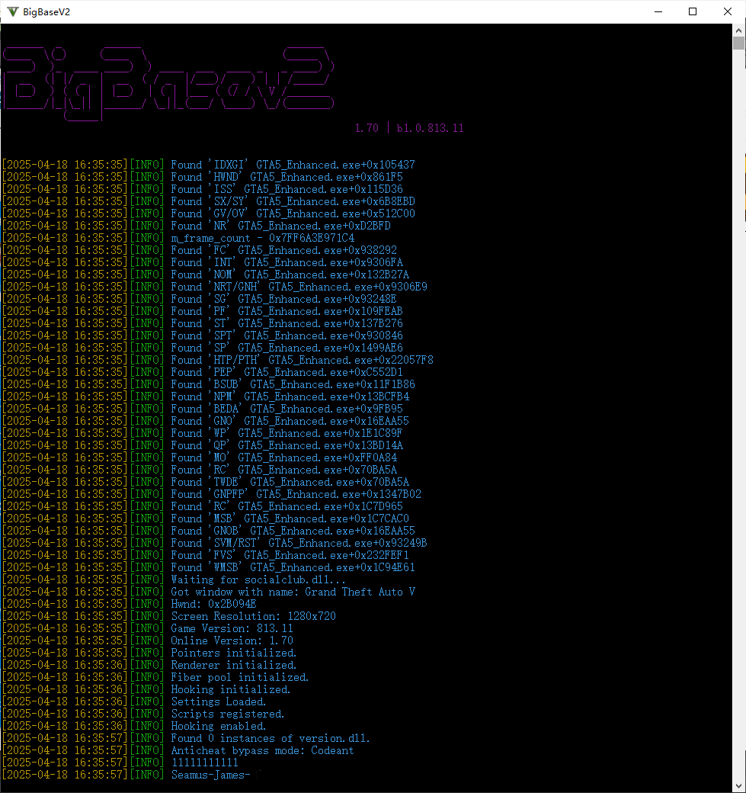

# BigBaseV2-Enhanced

> A GTA5 Enhanced DLL injection mod base built on BigBaseV2, supporting native function calls and compatible with GTA Online when launching the game with `-nobattleye`.

---

  

---

## ✨ Features

- Based on BigBaseV2 with modern enhancements
- Supports native function calls via crossmap
- Compatible with `-nobattleye` mode (BE manually disabled)
- Can enter GTA Online even with BE disabled
- No CMake required — just open with Visual Studio 2022
- Clean and modular structure for further mod development

---

## 🚀 Getting Started

1. Launch GTA5 with `-nobattleye` parameter:

2. Use your favorite injector (e.g., Xenos, GH Injector) to inject the built DLL.

3. Enter the game, and the mod menu should activate automatically or with a hotkey.

---

## 📁 Project Structure

- `src/` – core functionality
- `gui/` – ImGui menu and rendering logic
- `native/` – native call mapping
- `hook/` – function hooking logic
- `main.cpp` – injection entry

---

## 🧱 Build Instructions

- Open the `.sln` file with **Visual Studio 2022**
- Set configuration to `Release x64`
- Build and inject

No CMake or external build system required.

---

## ⚠️ Disclaimer

This project is open-sourced by **Codeant** and is intended for **educational and research use only**.  
**Commercial use is strictly prohibited.**  
The author shall not be held responsible for any consequences caused by the use of this code.

---

## 📜 License

MIT License — see [LICENSE](LICENSE) for full license text.

---

---

# BigBaseV2-Enhanced（中文版）

> 基于 BigBaseV2 的 GTA5 增强版 DLL 注入模组框架，支持原生函数调用。在使用 `-nobattleye` 关闭 BE 反作弊启动游戏时，依然可以正常进入 GTA Online 模式。

---

  

---

## ✨ 项目特色

- 基于 BigBaseV2 改写，架构清晰，功能现代化
- 支持原生函数调用（crossmap 映射）
- 启动游戏时使用 `-nobattleye` 关闭 BE 后仍可正常使用
- 可在关闭 BE 的前提下正常进入 GTA Online
- 无需 CMake，直接使用 Visual Studio 2022 打开即可编译
- 结构模块化，适合二次开发

---

## 🚀 快速开始

1. 启动 GTA5 并添加启动参数 `-nobattleye`：

2. 使用任意注入器（如 Xenos、GH Injector）注入编译好的 DLL。

3. 成功注入后进入游戏，菜单将自动加载，或通过快捷键唤出。

---

## 📁 项目结构

- `src/` – 核心功能逻辑
- `gui/` – ImGui 菜单界面及渲染
- `native/` – 原生函数映射模块
- `hook/` – 函数 Hook 实现
- `main.cpp` – 注入入口与初始化

---

## 🧱 编译方式

- 使用 **Visual Studio 2022** 打开项目解决方案 `.sln`
- 配置选择 `Release x64`
- 直接编译并生成 DLL 即可注入使用

无需 CMake，无需复杂构建流程。

---

## ⚠️ 免责声明

本项目由 **Codeant** 开源，仅供学习与研究使用。  
**严禁用于任何形式的商业用途。**  
使用本代码所造成的一切后果由使用者自行承担，作者不承担任何责任。

---

## 📜 开源协议

MIT 开源协议 — 完整协议内容见 [LICENSE](LICENSE) 文件。
